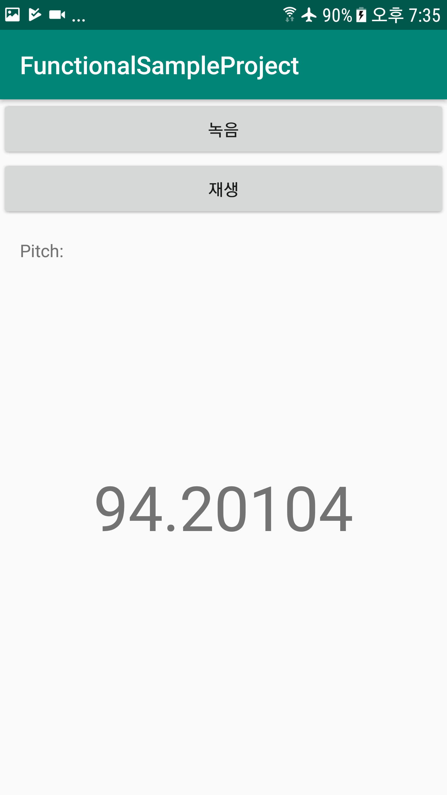
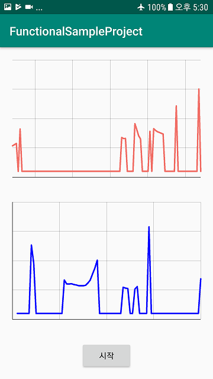

## 중국어 억양 비교 프로젝트

중국어의 경우 성조라는 개념이 존재하기 때문에 정확한 의사 소통을 위해서 단어의 발음뿐만 아니라 억양을 고려해야 한다. 
이것은 악기 없이 목소리만으로 노래를 부르는 것과 유사하다. 결국 억양은 일종의 멜로디와 같다고 볼 수 있다. 
MIR(Music Information Retrieval) 분야에서는 이미 여러 악기/목소리가 포함된 음악으로부터 주요 멜로디를 추출하고, 멜로디를 표현하고, 유사도 비교를 하는 등의 다양한 연구가 수행되었다. 
특히 Query-by-Humming(허밍을 통한 음악 검색) 관련 연구에서는 이러한 접근 방법들을 모두 포함하고 있다. 
따라서, 기존에 MIR 분야에 적용되던 접근 방법을 중국어 억양 비교 문제에도 동일하게 적용할 수 있다.

음악 정보 검색(MIR) 커뮤니티는 최근 몇 년 동안 [G. E. Poliner, et al., Melody transcription from music audio: Approaches and evaluation, 2007](http://www.ee.columbia.edu/~graham/papers/PolinerEFGSO07.pdf)에서 정의한 ‘멜로디(Melody)’에 대한 정의를 수용하고 있다.

> “**멜로디**는 다음/다성(polyphonic) 음악을 청자에게 들려준 후 휘파람이나 허밍으로 재현을 요구할 경우 청취자가 재현할 수 있는 단일(monophonic) 음높이의 시퀀스이며, 청취자는 음악을 비교할 때 해당 멜로디를 그 음악의 '본질'로써 인식한다”

* Polyphonic Music: 여러 악기(예: 음성, 기타 및 베이스) 또는 한 번에 두 개 이상의 음을 연주 할 수 있는 단일 악기 (예 : 피아노)를 사용하여 두 개 이상의 음을 동시에 들을 수 있는 음악을 말합니다.
* Monophonic Music: 한 번에 하나의 음으로 연주되는 음악.
* Fundamental frequency(F0): 주요 멜로디의 피치에 해당하는 기본 주파수.

다성 음악(Polyphonic Music)에서 주요 멜로디를 찾는 작업은 여러 음으로부터 중심 멜로디를 감지하고, 추출하는 등 상대적으로 복잡한 알고리즘을 필요로 한다. 
하지만 목소리 하나만 포함된 Monophonic Music 파일에서는 이러한 과정 없이 전체 소리에 대한 멜로디 추출 과정만 진행하면 되기 때문에 다루기에 용이하다.

음성 데이터를 waveform 자체로는 비교나 응용에 사용하기는 어렵기 때문에 적절한 형태로 변환하는 과정이 필요한데, 이때 주로 사용하는 방법은 주요 주파수 추정치(fundamental frequency estimates) 시퀀스 혹은 음표(notes) 시퀀스로 표현하는 방법이다.

단일 피치 사운드에서 F0 즉, 주요 주파수를 측정방법은 여러 가지가 존재한다. 
해당 프로젝트에서는 [YIN algorithm - YIN, a fundamental frequency estimator for speech and music](http://recherche.ircam.fr/equipes/pcm/cheveign/ps/2002_JASA_YIN_proof.pdf)을 통해 단일 음성으로부터 Pitch Detection을 수행할 것이다.

## YIN - Fundamental Frequency Estimator
중국어 음성으로부터 F0 즉, fundamental frequency를 추출하는 데에는 YIN algorithm을 사용한다. 
단일 음성은 Monophonic sound에 속하며, 이로부터 F0 추출을 통해 Pitch를 얻을 수 있음.
YIN 알고리즘은 잘 알려진 autocorrelation method를 기반으로 하며, 추정 오류를 피하기 위한 여러 가지 개선 기법이 포함되어 있다. 

> * 음성 데이터베이스 기반 실험을 통해 후행 처리가 없는 경쟁 기법보다 오류율이 3배 정도 더 개선되었다.
> * 매개 변수가 거의 없으며 미세 조정이 필요하지 않다. 

YIN 알고리즘은 아래와 같은 순서를 통해 원본 음성 데이터로부터 최종 F0 값을 추출할 수 있다.

1.	The autocorrelation function (ACF)
2.	Difference function
3.	Cumulative mean normalized difference function
4.	Absolute threshold
5.	Parabolic interpolation
6.	Best local estimate

## Similarity Measure
두 F0 time series 간 유사도 측정을 위해 시계열을 grid-based matrix로 표현하고, matrix 표현 상에서의 유사도 비교 알고리즘인 GMED(Grid Matrix Euclidean Distance)와 GMDTW(Grid Matrix Dynamic Time Warping)을 사용한다. 

## Android Sample Program

> * [RecordPlayActivity](https://github.com/junyoung-jamong/Chinese-Accent-Comparison/blob/master/FunctionalSampleProject/app/src/main/java/com/smartjackwp/junyoung/functionalsampleproject/RecordPlayActivity.java)
> * [PitchRealTimeGraphActivity](https://github.com/junyoung-jamong/Chinese-Accent-Comparison/blob/master/FunctionalSampleProject/app/src/main/java/com/smartjackwp/junyoung/functionalsampleproject/PitchRealTimeGraphActivity.java)

#### RecordPlayActivity

#### PitchRealTimeGraphActivity

## References
> * [G. E. Poliner, et al., Melody transcription from music audio: Approaches and evaluation, 2007.](http://www.ee.columbia.edu/~graham/papers/PolinerEFGSO07.pdf)
> * [Alain de Cheveigne, et al., YIN, a fundamental frequency estimator for speech and music, 2002.](http://recherche.ircam.fr/equipes/pcm/cheveign/ps/2002_JASA_YIN_proof.pdf)
> * [Yanqing Ye, et al., Similarity measures for time series data classification using grid representation and matrix distance, 2018.](https://link.springer.com/article/10.1007/s10115-018-1264-0)
